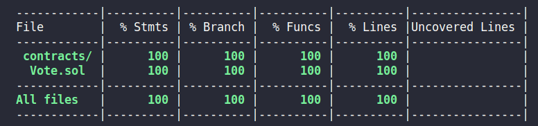

# Projet Alyra 2 : Tests unitaires

## Table of Contents

-  [Projet Alyra 2 : Tests unitaires](#projet-alyra-2--tests-unitaires)
   -  [Table of Contents](#table-of-contents)
   -  [Presentation](#presentation)
   -  [Technologie](#technologie)
   -  [Installation](#installation)
   -  [Stratégie de test](#stratégie-de-test)

## Presentation

Ce projet fait suite aux cours Alyra portant sur les tests unitaires d'un code Solidity.
Les tests sont réalisés sur la correction du projet 1 du système de Vote.

## Technologie

Versions des outils utilisés :

-  node : 16.16.0
-  hardhat : 2.14.1
-  solc : 0.8.13

## Installation

Installation initial :

```
npm install
```

Lancement des tests :

```
npx hardhat test
```

Obtention de la couverture de tests

```
npx hardhat coverage
```

## Stratégie de test

Les tests couvrent 100% des instructions/branches/fonctions/lignes

Les suites de tests sont divisés en 4 groupes (describe) pour vérifier le fonctionnement de chaque étape du workflow de Vote:

-  L'enregistrement des votants (Test register voters)
-  L'enregistrement des propositions de votes (Test register a proposal)
-  L'ajout de votes (Test adding a vote)
-  Le compte des votes (Test count votes)

Un cinquième groupe permet de vérifier le fonctionnement du workflow (Test workflow)
